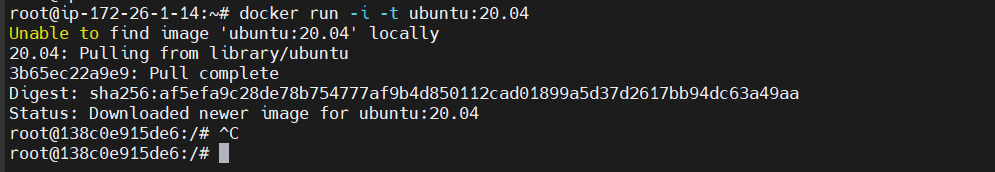
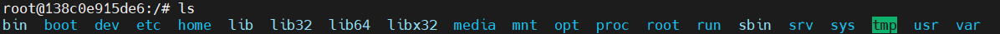
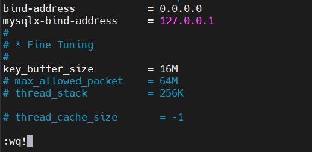
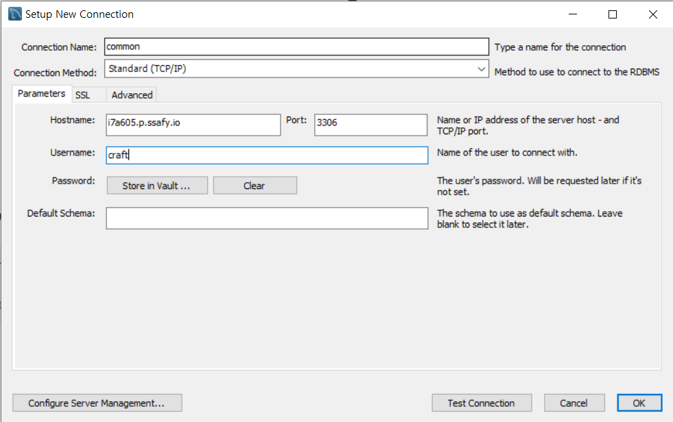
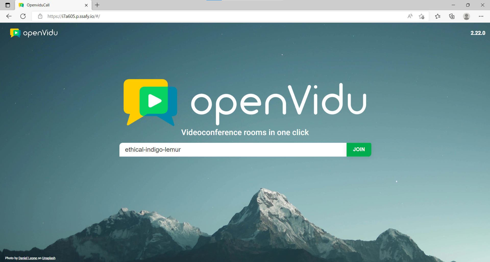
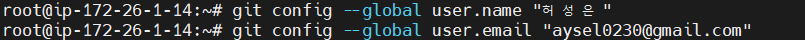
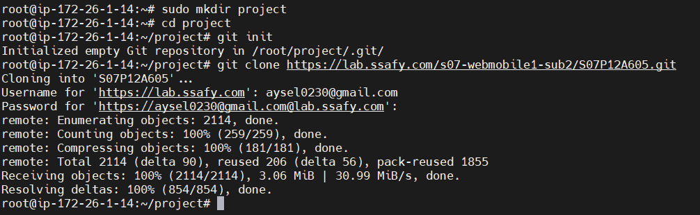
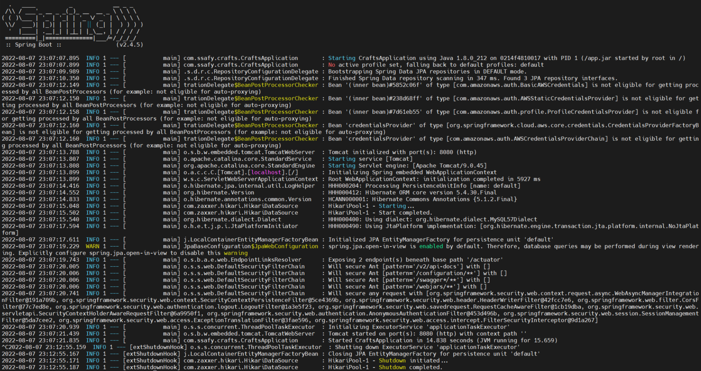

# 🧶CLIV
온라인 실시간 수업을 기반으로 한 공예생활 플랫폼  
> 🔗배포 링크 : http://i7a605.p.ssafy.io

<br/>  


## 📆 프로젝트 개요
- **진행 기간** : 2021.07.11 ~ 2022.08.19
- 온라인으로 실시간 공예 수업을 듣고 싶은 사람들을 위한 커뮤니티 & 화상수업 플랫폼 서비스 
- **주요기능**
    - 실시간 공예 수업
    - 수업 내 도움요청 기능
    - 맞춤 클래스 추천
    - 1:1 수업 매칭

## 🐻개발 환경 및 구성
### Back-end
- Spring Boot 2.4.5 (Gradle)

- DB : MYSQL 8.0.30
- JAVA : openJDK (1.8.0_332)
- Docker : 20.10.17
- Nginx 1.18.0

### Front-end
- React 18.2.0

- Node.js: 18.7.0
- OpenVidu : 2.20.0

## 👨팀원 소개

|  이름 | 역할  |     담당   |
| ------ | ------ | --------- |
| 김민주 | 팀원 | `Back-end` |
| 박지원 | 팀원 | `Front-end` |
| 조혜진 | 팀원 | `Front-end` |
| 최윤정 | 팀원 | `Front-end` |
| 허성은 | 팀장 | `Back-end` |
<br/>


# 🐳도커 설치
```
sudo apt-get update
```

## 필수 패키지 설치
```
$ sudo apt-get install \
       apt-transport-https \
       ca-certificates \
       curl \
       gnupg \
       lsb-release
```

### GPG Key 인증
```
$ curl -fsSL https://download.docker.com/linux/ubuntu/gpg | sudo apt-key add -
```

### docker repository 등록
```
$ sudo add-apt-repository "deb [arch=amd64] https://download.docker.com/linux/ubuntu $ (lsb_release -cs) stable"
```

## 도커 설치
```
$ sudo apt-get update
$ sudo apt-get install docker-ce docker-ce-cli containerd.io
```

## docker 네트워크 설정
```
sudo docker network create thxstorecicdnetwork
```

## 컨테이너 생성
```
docker run -i -t ubuntu:20.04

# 생성과 동시에 컨테이너 안으로 들어옴
```



## 명령어 모음
- 도커 컨테이너 보는 법
    - sudo docker ps -a
- 도커 컨테이너 삭제
    - sudo docker rm <container_id>
- 도커 이미지 보는 법
    - sudo docker images
- 도커 이미지 삭제
    - sudo docker rmi <image_id>
- 강제 옵션 -f (삭제가 안될 때,)
    - ex) docker rmi -f <image_id>
- 도커 로그 확인
    - docker logs <image_id> : 도커가 꺼져있어도(컨테이너가) 최종적으로 실행된 기록을 가지고 있습니다(오류 잡을 때, 매우 유용)
  
<br/>  

# 🔥방화벽 설정
### 현재 설정 확인
```
sudo ufw status
```
### `inactive` 로 설정되어 있으면 SSH 접속 허용하기
```
sudo ufw allow 22
sudo ufw enable
```  

<br/>  

# 🎄MySQL 설치 및 세팅
### MySQL 설치
```
sudo apt-get update
sudo apt-get install mysql-server
```
### MySQL 구동
```
sudo systemctl start mysql.service
```

### 외부 접속을 위해 포트(3306)열기 및 mysql 실행, 접속
```
$ sudo ufw allow mysql
$ sudo systemctl start mysql
$ sudo mysql -u root -p
```

### 계정 생성
```
CREATE USER '~'@'%' IDENTIFIED BY 'aksemfrhdwkfkddP';
```

### 데이터베이스 생성
```
CREATE DATABASE `dbdb` default CHARACTER SET UTF8;
```

### 권한 부여
```
GRANT ALL PRIVILEGES ON bloom.* to craft@'%'
```

### 권한 변경 후 flush, 권한 확인
```
FLUSH PRIVILEGES;
SHOW GRANTS FOR '~'@'%';
```
<br/>  

# 💔MySQL Workbench와 EC2에 있는 DB 연결하기
```
cd /etc/mysql/mysql.conf.d
vi mysqld.cnf
```

### bind-address 를 0.0.0.0 으로 수정


### 방화벽 설정 변경
```
sudo ufw allow 3306
```

### MySQL 재시작
```
sudo systemctl restart mysql.service
```
## MySQL Workbench에 Connection 추가


<br/>  

# 🖥️OpenVidu 서버 구축

### openvidu에서 사용하는 포트 확보하기
- 22 TCP, 80 TCP, 443 TCP, 3478 TCP+UDP, 40000~57000 TCP+UDP, 57001~65535 TCP+UDP 필요
### openvidu 설치
```
$ cd /opt   # openvidu는 /opt 디렉토리에 설치되는게 권장된다!
$ sudo curl https://s3-eu-west-1.amazonaws.com/aws.openvidu.io/install_openvidu_latest.sh | sudo bash
```

### 설정 파일 수정(.env)
```
$ cd /opt/openvidu
$ sudo vi .env
```
```
DOMAIN_OR_PUBLIC_IP=<Linux 서버의 public ip 주소 또는 도메인>
OPENVIDU_SECRET=<사용할 비밀번호 입력>
CERTIFICATE_TYPE=letsencrypt # default 값은 selfsigned지만 selfsigned 방식 사용시 보안 문제를 야기합니다.
	 # SSL 키가 있다면 owncert 방식으로 하되, /owncert 디렉토리 안에 키가 있어야함!
LETSENCRYPT_EMAIL=<이메일> 
HTTP_PORT=80
HTTPS_PORT=443
# HTTP_PORT와 HTTPS_PORT는 letsencrypt 방식의 키를 발급 받기 전까진 기본 포트인 80, 443을 사용해야 합니다!
# 키를 발급받고 난 후부터는 포트 변경해도 무방하다!
```

### openvidu 서버 실행
```
$ sudo ./openvidu start
```
- Docker Container 확인
```
$ sudo docker ps
```
Docker Container에 openvidu-coturn, kurento-media-server, openvidu-server, openvidu-redis, openvidu-proxy, openvidu-call 가 올라와 있으면 정상!

- https://<DOMAIN_OR_PUBLIC_IP>:<HTTPS_PORT> 접속 시 정상 동작하면 성공!



### openvidu 서버 종료
```
$ sudo ./openvidu stop

# openvidu 서버 재실행
$ sudo ./openvidu restart
```
<br/>  

# 🍫git 연동

### git 계정 설정


### 프로젝트 폴더 생성 후 git clone


<br/>  

# 🐬도커 파일 생성
### FrontEnd Dockerfile
```
FROM node:18 as build-stage
# 현재 경로에 있는 모든 파일들을 /app으로 모두 파일을 복사
WORKDIR /app  
ADD . .
RUN npm install
RUN npm run build

# 도커 허브에 있는 이미지를 가져온다.
FROM nginx:stable-alpine as production-stage
#컨테이너 안에 nginx.conf를 옆 해당겨로에 옮겨준다.
COPY  ./nginx/nginx.conf /etc/nginx/conf.d/default.conf 

# 위에 build-stage 작업에서  /app/dist 를  /user/share/nginx/html로 옮겨준다. 
COPY --from=build-stage /app/dist /usr/share/nginx/html
# 컨테이너가 실행할 때 nginx를 실행해 준다. 
CMD ["nginx", "-g", "daemon off;"]
```

### BackEnd Dockerfile
```
FROM openjdk:8-jdk-alpine
ARG JAR_FILE=build/libs/*.jar
COPY ${JAR_FILE} app.jar
EXPOSE 8080
ENV TZ=Asia/Seoul
ENTRYPOINT ["java","-jar","/app.jar"]
```

### Dockerfile로 이미지 생성하기
- Frontend
```
# -t <생성할 이미지명>:<태그명> <Dockerfile 위치>
docker build -t frontend:0.1 /root/project/S07P12A605/FE
```

- Backend
```
docker build -t backend:0.1 /root/project/S07P12A605/BE
```
docker build 전에 프로젝트 터미널에서 ./gradlew build 을 통해 jar 파일을 생성해야 한다.

<br/>  

# 🐬컨테이너 실행하기
- Backend
```
sudo docker run -p 8080:8080 backend:0.1
```



