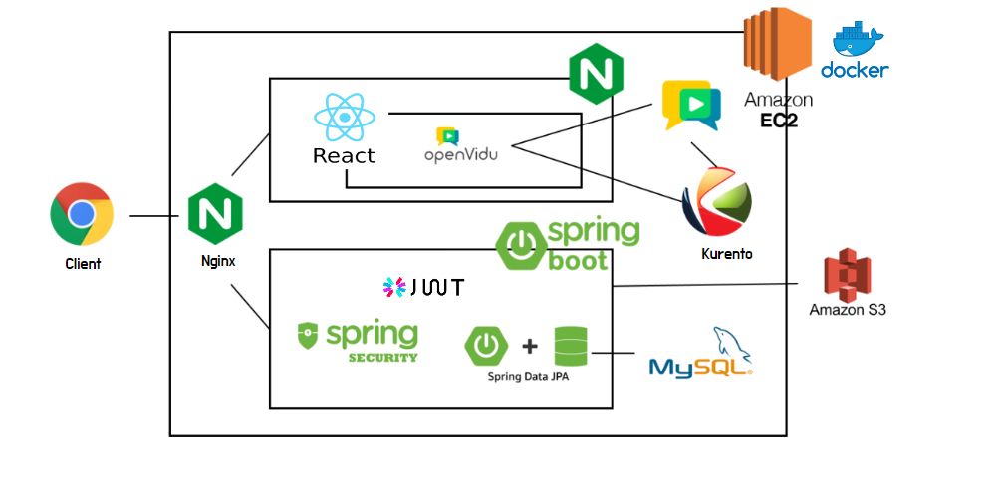

# 🧶CLIV

온라인 실시간 수업을 기반으로 한 공예생활 플랫폼

 

## 📆 프로젝트 개요

- **진행 기간** : 2021.07.11 ~ 2022.08.19
- 온라인으로 실시간 공예 수업을 듣고 싶은 사람들을 위한 커뮤니티 & 화상수업 플랫폼 서비스
- **주요기능**
  - 실시간 공예 수업
  - 수업 내 도움요청 기능
  - 맞춤 클래스 추천
  - 1:1 수업 매칭

## 👨팀원 소개

| 이름   | 역할 | 담당        |
| ------ | ---- | ----------- |
| 김** | 팀원 | `Back-end`  |
| 박지원 | 팀원 | `Front-end` |
| 조** | 팀원 | `Front-end` |
| 최** | 팀원 | `Front-end` |
| 허** | 팀장 | `Back-end`  |

## 🐻개발 환경 및 구성

### Back-end

- Spring Boot : Spring Boot 2.4.5 (Gradle)
- DB : MYSQL 8.0.30
- JAVA : openJDK (1.8.0_332)
- Docker : 20.10.17
- Nginx 1.18.0

### Front-end

- React 18.2.0
- Node.js: 18.7.0
- OpenVidu : 2.20.0

 

# 시스템 아키텍쳐 구조

